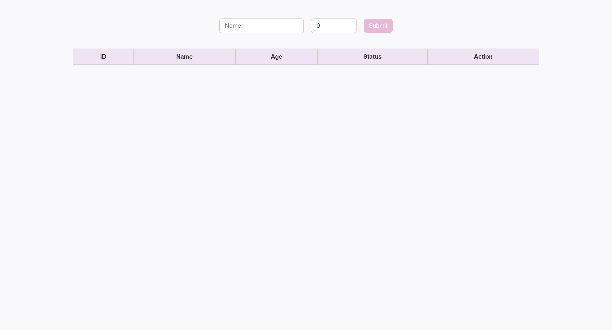

# User Status Toggle System

[](#)
[](#)
[](./LICENSE)

> A clean and lightweight PHP + MySQL web app that lets you add users and toggle their active/inactive status instantly.

---

## Demo Preview

  
*Simple interface for adding users and toggling their status live.*

---

## Features
- Add new users with name and age
- Toggle user status without page reload (AJAX)
- Input validation (no negative age)
- MySQL database connection with PHP
- Responsive design with soft UI

---

## Folder Structure
```bash
live-user-toggle-system/
├── index.html
├── style.css
├── db.php
├── insert.php
├── update.php
├── fetch.php
```
---

## Tech Stack
- **HTML / CSS / JavaScript**
- **PHP 8+**
- **MySQL (phpMyAdmin)**
- **XAMPP for local server**

---

## Getting Started
1. Copy the folder to `htdocs` in XAMPP
2. Start Apache + MySQL
3. Open browser: `http://localhost/live-user-toggle-system/index.html`

---

## Notes
- DB name: `user_management`
- Table: `users`
- Default status = active

---

## License

This project is licensed under the MIT License - see the [LICENSE](./LICENSE) file for details.
